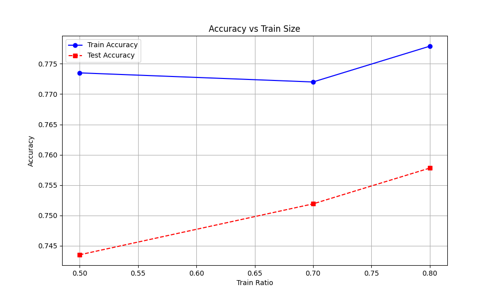
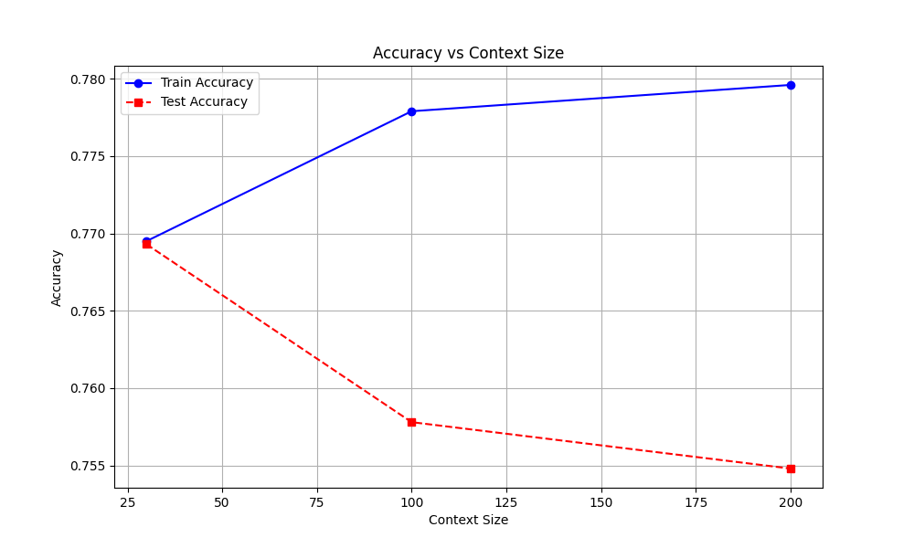
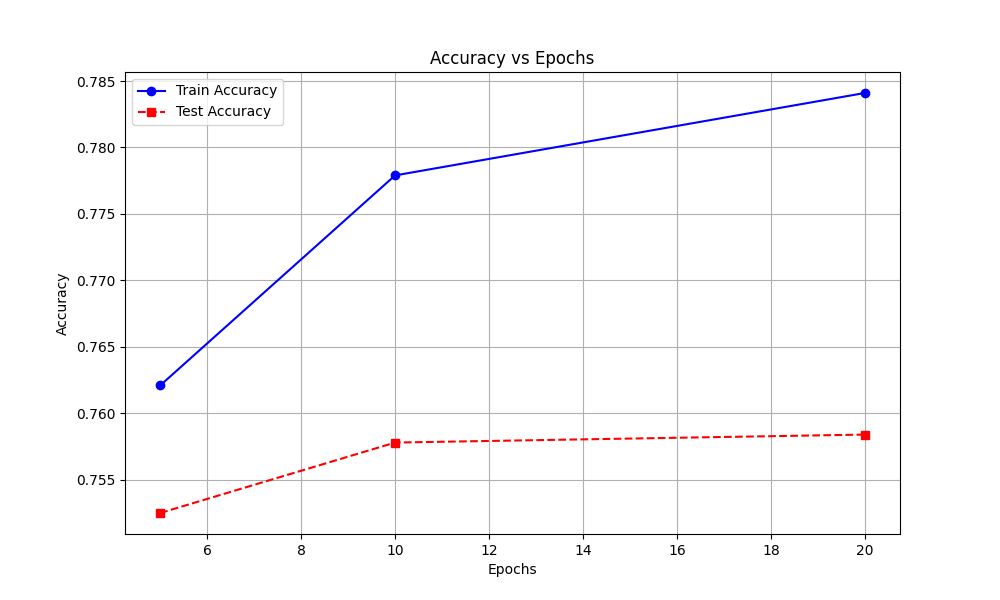

# Informe de resultados

Este documento presenta una versión ampliada del informe original, con mayor detalle metodológico, interpretación de resultados y recomendaciones prácticas para la tarea de clasificación binaria de letras de canciones.

Resumen ejecutivo
------------------
- Objetivo: estudiar cómo afectan tres factores —tamaño del conjunto de entrenamiento, longitud de la ventana de contexto y número de épocas— al rendimiento y la generalización de un clasificador tipo Bengio (embedding + suma + MLP) en una tarea binaria sobre letras de canciones.
- Resultado principal: incrementar la cantidad de datos de entrenamiento mejora de forma consistente la precisión en test; ventanas de contexto largas tienden a aumentar el sobreajuste en este modelo de agregación por suma; aproximadamente 10 épocas ofrecen un equilibrio razonable entre rendimiento y coste computacional.
- Recomendación práctica (punto de partida): `train_ratio=0.8`, `context_size=30`, `epochs=10`.

1. Motivación y contexto
------------------------
Clasificar canciones por autor/estilo o por categoría A/B puede apoyarse en señales léxicas (palabras y tokens frecuentes) y en señales secuenciales (orden de versos, progresiones temáticas). El modelo analizado (tipo Bengio) agrega embeddings por suma, lo que lo hace sensible al contenido léxico pero ciego a la permutación del orden. Por ello resulta imprescindible evaluar cómo varían las métricas al cambiar la cantidad de datos, el tamaño de contexto y el tiempo de entrenamiento.

2. Datos y preprocesado (detallado)
-----------------------------------
- Corpus: `corpusA.txt` (clase 0) y `corpusB.txt` (clase 1). Se usan hasta 5000 canciones por clase cuando están disponibles.
- Partición: partición train/test por fracción (`train_ratio`): 0.5, 0.7 y 0.8; semilla fija `42` para reproducibilidad en estos experimentos. Nota: los resultados mostrados se obtienen con una sola semilla; es recomendable repetir con múltiples semillas y reportar medias ± desviación estándar.
- Tokenización: se conservan los tokens especiales `<CS>`, `</CS>`, `<EOL>`, palabras y signos de puntuación para preservar límites y estructura de versos.
- Vocabulario: construido únicamente sobre el conjunto de entrenamiento; tokens especiales: `<PAD>=0`, `<UNK>=1`; umbral `min_freq=2` para filtrar tokens raros. (Si se dispone del tamaño final de vocabulario, añadir aquí el número para mayor reproducibilidad.)

Detalles operativos
-------------------
- Extracción de ventanas: para cada canción se toma la primera ventana de longitud `context_size` tokens. Si la canción tiene menos tokens se rellena con `<PAD>`; si tiene más, se trunca al inicio. (Esta es la configuración usada en los experimentos reportados; en estudios futuros se puede probar muestreo aleatorio o ventanas deslizantes.)
- Construcción del vocabulario: se cuentan frecuencias en el conjunto de `train`; las entradas con frecuencia < 2 se etiquetan como `<UNK>`; se asigna índice 0 a `<PAD>` y 1 a `<UNK>`.
- Aleatorización y particionado: se barajan las canciones con semilla `42` antes de partir en train/test para asegurar reproducibilidad.
- Registro de experimentos: los resultados se guardaron por combinación de (`train_ratio`, `context_size`, `epochs`) incluyendo métricas `train_acc` y `test_acc` para facilitar trazabilidad.

3. Modelo y configuración de entrenamiento
-----------------------------------------
- Arquitectura: Embedding (dim=64) → suma de embeddings por ventana de `context_size` tokens → MLP: `Linear(64→128)` + `ReLU` → `Linear(128→1)`.
- Pérdida: `BCEWithLogitsLoss`.
- Optimización: Adam con tasa de aprendizaje `1e-4`.
- Hiperparámetros fijos: `batch_size=32`, `embed_dim=64`, `hidden=128`, `seed=42`.
- Métricas reportadas: `train_acc` (exactitud en entrenamiento), `test_acc` (exactitud en test) y `gap = train_acc - test_acc` (medida simple de sobreajuste). Se recomienda complementar con `precision`, `recall`, `F1` y curvas ROC/PR cuando haya desbalance de clases.

4. Diseño experimental
----------------------
Se realizaron tres barridos independientes con diseño one-factor-at-a-time para analizar el efecto aislado de cada factor:

- Barrido A (tamaño de entrenamiento): variar `train_ratio` (0.5, 0.7, 0.8) manteniendo `context_size=100`, `epochs=10`.
- Barrido B (tamaño de contexto): variar `context_size` (30, 100, 200) manteniendo `train_ratio=0.8`, `epochs=10`.
- Barrido C (número de épocas): variar `epochs` (5, 10, 20) manteniendo `train_ratio=0.8`, `context_size=100`.

Razonamiento: aislar variables simplifica la interpretación; como extensión se propone un estudio factorial que explore interacciones entre factores.

5. Resultados y análisis (interpretación ampliada)
-------------------------------------------------

5.1 Efecto del número de sentencias en entrenamiento

- Observaciones: al aumentar `train_ratio` de 0.5→0.8, `test_acc` sube de 0.7435 a 0.7578 y el `gap` disminuye de 0.0300 a 0.0201; `train_acc` se mantiene en torno a 0.77–0.78.
- Interpretación: la mejora en test indica reducción de varianza y mejor cobertura léxica del dominio cuando hay más ejemplos. La estabilidad de `train_acc` sugiere que el modelo ya alcanza una capacidad empírica similar en entrenamiento y que la ganancia proviene de generalizar mejor, no de memorizar más.
- Implicaciones prácticas: priorizar la adquisición o anotación de más canciones suele ser la vía más segura para mejorar generalización; el coste computacional aumenta con el tamaño del conjunto, por lo que conviene balancearlo según recursos.

Tabla de resultados (barrido `train_ratio`, `context_size=100`, `epochs=10`)

| train_ratio | n_train | n_test | train_acc | test_acc | gap |
|---:|---:|---:|---:|---:|---:|
| 0.5 | 3271 | 3271 | 0.7735 | 0.7435 | 0.0300 |
| 0.7 | 4579 | 1963 | 0.7720 | 0.7519 | 0.0201 |
| 0.8 | 5233 | 1309 | 0.7779 | 0.7578 | 0.0201 |

5.2 Efecto del tamaño de la ventana de contexto

- Observaciones: `test_acc` es máxima para `context_size=30` (0.7693), y decrece para 100 (0.7578) y 200 (0.7548). En cambio, `train_acc` aumenta ligeramente con la ventana, y el `gap` crece de 0.0002 a 0.0248.
- Interpretación técnica: sumar embeddings de ventanas largas introduce más tokens al vector agregado; si muchos de esos tokens son informativos, la performance debería mejorar, pero si son ruidosos la representación agregada empeora la señal discriminativa. El aumento del `train_acc` combinado con la caída en `test_acc` es un indicador clásico de sobreajuste por exceso de información no explotada por la arquitectura.
- Consecuencia: en modelos de agregación no secuencial, ventanas muy largas pueden ser contraproducentes. Para beneficiarse de contextos largos, conviene usar arquitecturas que modelen orden/atención (RNN, Transformer) o aplicar técnicas de selección/ponderación de tokens.

Tabla de resultados (barrido `context_size`, `train_ratio=0.8`, `epochs=10`)

| context_size | n_train | n_test | train_acc | test_acc | gap |
|---:|---:|---:|---:|---:|---:|
| 30  | 5233 | 1309 | 0.7695 | 0.7693 | 0.0002 |
| 100 | 5233 | 1309 | 0.7779 | 0.7578 | 0.0201 |
| 200 | 5233 | 1309 | 0.7796 | 0.7548 | 0.0248 |

5.3 Efecto del número de épocas

- Observaciones: `train_acc` crece de forma sostenida entre 5 y 20 épocas (0.7621 → 0.7841). `test_acc` mejora entre 5 y 10 (0.7525 → 0.7578) pero se estanca entre 10 y 20 (0.7578 → 0.7584). El `gap` aumenta con las épocas.
- Interpretación: la fase inicial de entrenamiento corrige errores de bias y mejora tanto train como test; pasado cierto punto el modelo entra en una fase donde mejora el ajuste a datos de entrenamiento sin transferir esa mejora al test (sobreajuste). El punto de inflexión observado está cerca de 10 épocas para la configuración evaluada.
- Recomendación: usar early stopping sobre una partición de validación o mantener ~10 épocas como máximo si no hay validación.

Tabla de resultados (barrido `epochs`, `train_ratio=0.8`, `context_size=100`)

| epochs | n_train | n_test | train_acc | test_acc | gap |
|---:|---:|---:|---:|---:|---:|
| 5  | 5233 | 1309 | 0.7621 | 0.7525 | 0.0096 |
| 10 | 5233 | 1309 | 0.7779 | 0.7578 | 0.0201 |
| 20 | 5233 | 1309 | 0.7841 | 0.7584 | 0.0257 |

6. Conclusiones generales y recomendaciones
------------------------------------------

1) Cantidad de datos de entrenamiento

- Incrementar la cantidad de ejemplos de entrenamiento mejora la generalización de forma consistente en este problema y arquitectura.

2) Tamaño de ventana de contexto

- Para el modelo de agregación por suma, ventanas cortas (p.ej. 30 tokens) ofrecen mejor trade-off entre señal y ruido. Ventanas largas incrementan el `gap` y favorecen el sobreajuste.

3) Número de épocas

- Hay mejora clara al pasar de 5 a 10 épocas; más entrenamiento (p.ej. 20 épocas) aporta ganancias marginales en test y aumenta el sobreajuste.

Punto práctico sugerido: `train_ratio=0.8`, `context_size=30`, `epochs=10`.

7. Limitaciones y pasos siguientes recomendados
---------------------------------------------
- Los resultados actuales provienen de una sola semilla y partición; es necesario repetir con múltiples semillas (5–10) y reportar medias y desviaciones para robustez estadística.
- Evaluar métricas adicionales (`precision`, `recall`, `F1`, curvas ROC/PR) para entender mejor el comportamiento por clase.
- Probar regularización (dropout, weight decay), `early stopping` y técnicas de selección de tokens (TF-IDF, atención) para mitigar el aumento del `gap` con ventanas largas.
- Comparar de forma directa con una RNN (Elman) y/o Transformers: se espera que las arquitecturas secuenciales exploten mejor contextos largos y muestren una relación distinta entre `context_size` y `test_acc`.

8. Discusión crítica: Bengio (suma) vs Elman RNN
------------------------------------------------
La principal diferencia es el sesgo inductivo: la agregación por suma prioriza el contenido léxico global, mientras que la RNN modela dependencias secuenciales. Consecuencias:

- En Bengio, dos canciones con vocabularios similares pero distinto orden pueden quedar representadas de forma muy parecida.
- En RNN, el orden y la evolución temporal afectan el estado final, permitiendo distinguir patrones de estructura y estilo.

Hipótesis comprobables para trabajos posteriores:

- La curva `test_acc` frente a `context_size` será menos descendente (o incluso creciente en cierto rango) para RNN comparada con el modelo de suma.
- El contexto óptimo para RNN debería ser mayor que para el modelo de suma.

